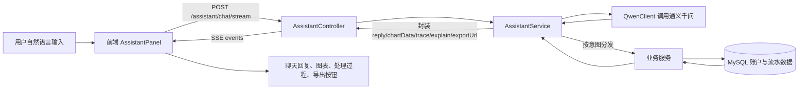
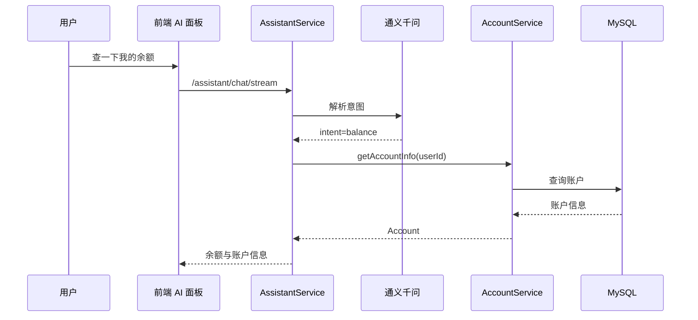
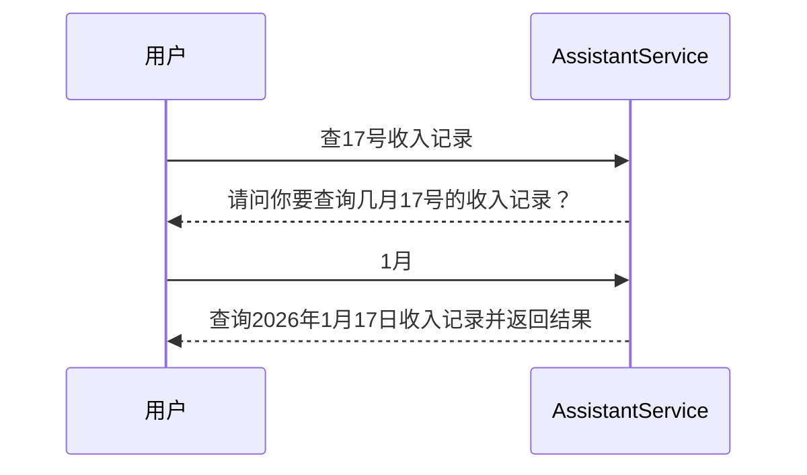
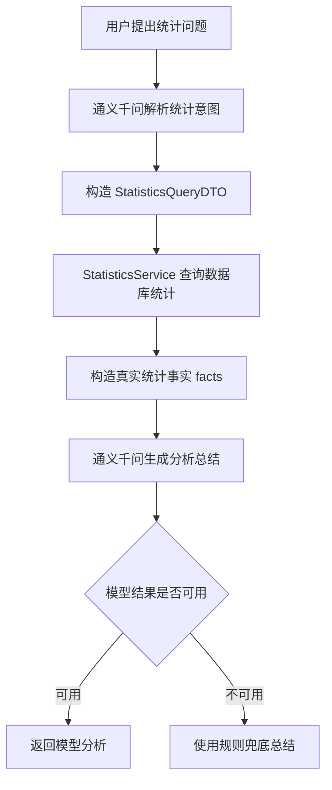
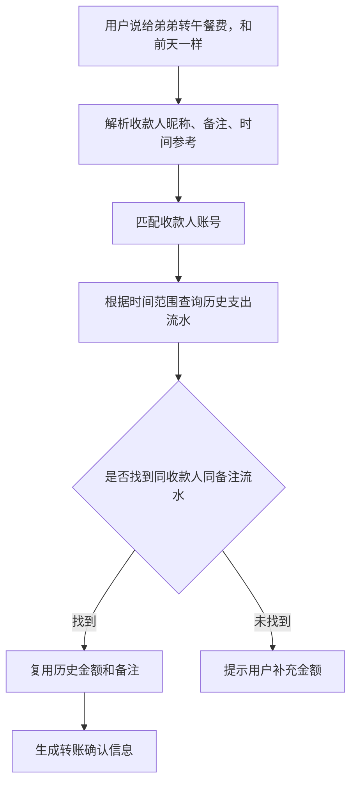

# BankCopilot AI 智能助手设计文档

## 1. 文档说明

本文档面向本科毕业设计展示与答辩，重点说明 BankCopilot 项目中的 AI 智能机器人设计。本文不重点描述登录、注册、普通页面管理等常规系统能力，只将它们作为 AI 功能运行的基础环境。

AI 部分的核心定位是：将自然语言输入转换为银行业务操作，通过真实账户、流水与统计数据返回可解释、可视化、可确认的智能服务结果。

## 2. AI 功能定位

BankCopilot 的 AI 智能助手不是单纯的聊天机器人，而是一个面向银行个人用户的业务型智能助手。它具备以下特点：

- 能理解用户自然语言表达。
- 能调用后端真实银行业务服务。
- 能基于数据库流水生成统计分析。
- 能返回图表、统计口径、处理过程和导出链接。
- 涉及资金操作时必须经过二次确认。
- 对未实现能力有明确边界控制，避免大模型编造能力。

项目中 AI 核心功能包括：

1. AI 查余额。
2. AI 查流水。
3. AI 账单统计与分析。
4. AI 周报 / 月报。
5. AI 智能转账。

自然语言意图识别、流式输出、时间解析、图表封装等属于 AI 基础设施，用来支撑以上核心功能。

## 3. 技术架构概览

### 3.1 技术栈

| 层级 | 技术 |
|---|---|
| 前端 | Vue 3、Element Plus、ECharts、Fetch SSE、Axios |
| 后端 | Spring Boot、MyBatis、PageHelper、EasyExcel |
| AI 模型 | 通义千问 DashScope 兼容 OpenAI Chat Completions 接口 |
| 数据库 | MySQL |
| 鉴权 | JWT Token |

### 3.2 AI 模块结构

后端主要文件：

| 文件 | 作用 |
|---|---|
| `AssistantController.java` | AI 接口入口，提供普通聊天、流式聊天、周/月报接口 |
| `AssistantService.java` | AI 核心编排服务，负责意图解析、业务分发、多轮状态、统计总结 |
| `QwenClient.java` | 通义千问调用封装 |
| `Time.java` | 自然语言时间纠偏与时间范围填充 |
| `PendingTransfer.java` | 待确认转账状态 |
| `PendingTransactionQuery.java` | 待补全流水查询状态 |
| `StatisticsServiceImpl.java` | 统计计算服务 |
| `TransactionMapper.xml` | 流水查询、聚合统计、趋势统计、历史转账匹配 SQL |

前端主要文件：

| 文件 | 作用 |
|---|---|
| `AssistantPanel.vue` | AI 聊天面板、周/月报卡片、图表渲染、导出、确认按钮 |
| `assistant.js` | AI 普通请求、SSE 流式请求、简报请求 |
| `index.vue` | 首页 AI 助手主展示入口 |
| `layout/index.vue` | 右上角智能客服抽屉入口 |

### 3.3 总体调用链路



## 4. AI 基础设施设计

### 4.1 自然语言意图识别

AI 助手首先将用户输入交给通义千问进行结构化解析。模型不直接执行业务，而是返回严格 JSON，后端再根据 JSON 调用确定的业务服务。

当前支持的意图：

| intent | 含义 | 是否核心功能 |
|---|---|---|
| `balance` | 查余额 / 查账户信息 | 是 |
| `transactions` | 查流水 | 是 |
| `statistics` | 账单统计、汇总、趋势分析 | 是 |
| `transfer` | 智能转账 | 是 |
| `other` | 兜底回答或不支持能力 | 否 |

意图解析目标 JSON：

```json
{
  "intent": "transfer|transactions|balance|statistics|other",
  "toAccountNo": "",
  "payeeAlias": "",
  "repeatMode": "",
  "amount": "",
  "description": "",
  "txnType": "",
  "limit": "",
  "year": "",
  "month": "",
  "day": "",
  "timeRange": "",
  "rangeValue": "",
  "needMonth": false,
  "metric": "",
  "groupBy": "",
  "comparePrevious": false
}
```

设计原则：

- 大模型只负责理解自然语言，不直接修改账户或流水。
- 所有资金与数据查询都由后端业务服务执行。
- 后端会对模型返回结果再次校验。
- 对不支持的“消费分类、商户类型、场景标签”等需求，强制归为 `other`。

### 4.2 时间解析与纠偏

自然语言中的时间表达由两部分处理：

1. 通义千问尽量提取 `year`、`month`、`day`、`timeRange`、`rangeValue`。
2. 后端 `Time.normalizeTimeByText` 再进行确定性纠偏。

支持的时间表达包括：

| 用户表达 | 后端时间范围 |
|---|---|
| 今天 / 昨天 / 前天 / 大前天 | 单日范围 |
| 本周 / 上周 | 周范围 |
| 本月 / 上月 / 上上月 | 月范围 |
| 本季度 / 上季度 | 季度范围 |
| 今年 / 去年 / 前年 | 年范围 |
| 最近几天 / 前几天 | 最近 N 天 |
| 最近一周 / 最近一个月 / 最近三个月 | 最近 N 天 |
| 最近几年 / 近两年 | 最近 N 年 |

这样做的原因是：时间表达具有较强规则性，后端确定性处理比完全依赖大模型更稳定。

### 4.3 AI 流式输出

前端优先调用：

```http
POST /assistant/chat/stream
```

后端通过 `SseEmitter` 返回事件：

| SSE event | 作用 |
|---|---|
| `trace` | 返回阶段性处理过程，例如请求接收、意图识别 |
| `message` | 返回最终 AI 业务结果 |
| `error` | 返回错误信息 |
| `done` | 表示本次处理结束 |

如果流式接口失败，前端会自动降级调用普通接口：

```http
POST /assistant/chat
```

### 4.4 AI 过程追踪

每次 AI 回复都会尽量带上 `trace` 元信息：

```json
{
  "intent": "statistics",
  "tool": "statistics_service",
  "status": "completed",
  "confidence": "high",
  "timeRange": "month",
  "steps": [
    "识别为统计意图",
    "查询统计服务",
    "生成分析总结"
  ]
}
```

前端会将其展示为“AI处理过程”，方便答辩时说明系统不是黑盒聊天，而是可解释的业务调用链。

## 5. 核心功能一：AI 查余额

### 5.1 功能描述

用户通过自然语言查询账户余额或账户基本信息，AI 助手识别为 `balance` 意图后，调用账户服务查询当前登录用户的账户数据，并以自然语言返回。

### 5.2 示例输入

- 查一下我的余额。
- 我的账户信息。
- 我卡里还有多少钱？

### 5.3 后端处理流程



### 5.4 返回内容

返回内容包括：

- 户名。
- 账号。
- 账户类型。
- 账户状态。
- 账户余额。

### 5.5 设计亮点

- 余额来自数据库真实账户数据，不由模型生成。
- AI 只负责理解“用户想查余额”。
- 返回结果附带 `trace`，展示识别和查询过程。

## 6. 核心功能二：AI 查流水

### 6.1 功能描述

用户可以用自然语言查询交易流水。AI 会解析收入/支出、时间范围、查询条数等条件，后端根据解析结果查询 `transaction_record` 表，并格式化返回。

### 6.2 示例输入

- 查最近 3 条支出记录。
- 查今年 1 月的收入记录。
- 查今天的流水。
- 查前几天的支出记录。
- 查 17 号收入记录。

### 6.3 支持的查询条件

| 条件 | 字段 |
|---|---|
| 收入 / 支出 | `txnType` |
| 查询条数 | `limit` |
| 年份 | `year` |
| 月份 | `month` |
| 日期 | `day` |
| 时间范围 | `timeRange` |
| 最近 N 天 / N 年 | `rangeValue` |

### 6.4 多轮补全设计

当用户只说“查 17 号收入记录”时，系统无法确定月份。此时 AI 助手不会随意猜测，而是进入多轮补全流程。

流程如下：



后端通过 `pendingTxnQueryMap` 临时保存待补全查询：

| 字段 | 作用 |
|---|---|
| `type` | 收入 / 支出 |
| `day` | 日期 |
| `month` | 待用户补全 |
| `year` | 年份，缺省为当前年 |
| `limit` | 查询条数 |
| `createdAt` | 多轮状态创建时间 |

待补全状态有效期为 10 分钟。

### 6.5 返回内容

AI 返回流水列表，包含：

- 序号。
- 交易时间。
- 类型。
- 金额。
- 对方账号，做脱敏处理。
- 备注。

同时返回 `explain`，用于说明查询口径：

```json
{
  "txnType": "支出",
  "startTime": "2026-04-01T00:00",
  "endTime": "2026-04-30T23:59:59",
  "limit": 10
}
```

### 6.6 设计亮点

- 支持自然语言时间表达。
- 支持收入、支出筛选。
- 支持多轮追问补全缺失条件。
- 对方账号脱敏，适合银行场景。
- 查询结果来自真实流水表。

## 7. 核心功能三：AI 账单统计与分析

### 7.1 功能描述

AI 账单统计与分析用于回答用户关于收入、支出、笔数、趋势、最大交易等问题。系统先通过 SQL 进行真实统计，再将统计事实交给大模型生成自然语言分析。

### 7.2 示例输入

- 统计这个月总支出。
- 最近 7 天我花了多少钱？
- 本月收入有多少笔？
- 最近最大一笔支出是多少？
- 看一下今年每个月的支出趋势。
- 分析一下本月收支情况。

### 7.3 支持的统计指标

| metric | 含义 | 示例 |
|---|---|---|
| `sum` | 总金额 | 统计这个月总支出 |
| `count` | 笔数 | 本月收入有多少笔 |
| `max` | 最大一笔 | 最近最大一笔支出 |
| `trend` | 趋势 | 今年每个月支出趋势 |

### 7.4 支持的分组方式

| groupBy | 含义 |
|---|---|
| `none` | 不分组，只返回单个统计结果 |
| `day` | 按天聚合 |
| `month` | 按月聚合 |

### 7.5 后端统计数据来源

统计数据主要来自 `TransactionMapper`：

| 方法 | 作用 |
|---|---|
| `sumAmount` | 统计收入或支出总金额 |
| `countByStatistics` | 统计流水笔数 |
| `maxTransaction` | 查询最大一笔交易 |
| `statisticsTrend` | 按天或按月生成趋势 |
| `sumIncomeAndExpense` | 收入与支出对比 |
| `statisticsByCounterparty` | 按对方账号聚合 |

### 7.6 分析生成流程

AI 分析不是让模型直接计算，而是采用“确定性计算 + 大模型总结”的方式。



### 7.7 反幻觉设计

统计总结提示词中明确要求：

- 只能基于系统给出的真实统计结果总结。
- 禁止编造金额、日期、占比。
- 至少引用具体数字。
- 不支持消费品类、商户类型、场景标签分析。
- 饼图只能称为“按对方账号聚合”，不能称为“消费分类”。

如果模型输出包含不支持的分类能力，后端会通过 `sanitizeModelReply` 回退到规则总结。

### 7.8 图表返回设计

AI 统计结果会返回 `chartType` 和 `chartData`，前端根据类型渲染图表。

| chartType | 用途 |
|---|---|
| `number` | 总额、笔数、最大一笔等单值结果 |
| `bar` | 趋势柱状图 |
| `line` | 前端可将趋势切换为折线图 |
| `overview` | 收支对比柱图 + 收入/支出按对方账号饼图 |

趋势图数据格式：

```json
[
  {
    "label": "2026-04-01",
    "value": 300
  },
  {
    "label": "2026-04-02",
    "value": 100
  }
]
```

概览图数据格式：

```json
{
  "bar": [],
  "incomePie": [],
  "expensePie": []
}
```

### 7.9 导出设计

统计结果会生成 `exportUrl`，用于下载当前统计口径下的流水明细。

示例：

```text
/transactions/export?accountId=1&type=支出&startTime=2026-04-01&endTime=2026-04-30
```

前端点击“下载明细报表”后，通过 Excel 文件导出相关流水。

### 7.10 设计亮点

- 统计数据由数据库聚合计算，保证结果可信。
- 大模型负责语言组织和洞察表达，不负责直接算账。
- 支持数字、趋势图、概览图和 Excel 导出。
- 返回统计口径，方便用户理解“统计了什么范围”。
- 有模型兜底策略，减少不稳定输出。

## 8. 核心功能四：AI 周报 / 月报

### 8.1 功能描述

AI 周报 / 月报是助手打开时自动展示的智能简报。它汇总当前用户在本周或本月的收支情况，并给出趋势、对比、异常提醒和快捷追问。

接口：

```http
GET /assistant/brief?period=week
GET /assistant/brief?period=month
```

### 8.2 简报内容

| 内容 | 说明 |
|---|---|
| `headline` | 简报标题，例如本月净流入 |
| `highlights` | 总收入、总支出、净流入 |
| `comparison` | 与上周或上月对比 |
| `anomalies` | 异常支出提醒 |
| `suggestions` | AI 建议 |
| `quickActions` | 快捷追问按钮 |
| `chartData` | 支出趋势图数据 |

### 8.3 周报 / 月报计算方式

系统分别构造收入、支出、支出趋势查询：

| 查询 | 指标 |
|---|---|
| 收入总额 | `txnType=收入, metric=sum` |
| 支出总额 | `txnType=支出, metric=sum` |
| 支出趋势 | `txnType=支出, metric=trend, groupBy=day` |

净流入计算：

```text
净流入 = 总收入 - 总支出
```

### 8.4 对比分析

简报会对比当前周期与上一周期：

| 当前周期 | 对比周期 |
|---|---|
| 本周 | 上周 |
| 本月 | 上月 |

对比项包括：

- 收入变化百分比。
- 支出变化百分比。
- 净流入变化百分比。

### 8.5 异常检测

当前实现包含两类异常检测：

1. 当前周期支出显著高于近 4 周周均值。
2. 当前周期最大单笔支出超过近 30 天支出金额 P90 阈值。

异常检测用于给出“当前支出偏高”或“出现超大单笔支出”等提醒。

### 8.6 快捷追问

简报会生成快捷操作，例如：

- 看本月支出明细。
- 统计本月总支出。
- 看本月收入趋势。

用户点击后会自动作为聊天输入发送给 AI 助手，形成从简报到对话的连续体验。

### 8.7 设计亮点

- 用户打开 AI 面板就能看到财务概览，不必先提问。
- 支持周报 / 月报切换。
- 有趋势图、环比对比、异常提醒和快捷追问。
- 月报建议由 AI 基于真实收支事实生成。

## 9. 核心功能五：AI 智能转账

### 9.1 功能描述

AI 智能转账支持用户用自然语言描述转账需求。系统解析收款人、金额、备注，完成转账前校验，并要求用户二次确认后才真正执行转账。

### 9.2 示例输入

- 给弟弟转 300 元，备注午餐费。
- 向 6222000012345678 转 100 元。
- 给老李转 200 元，备注团建费。
- 给弟弟转午餐费，和前天一样。
- 给弟弟转晚餐费，和上个月一样。

### 9.3 支持的收款人识别方式

| 方式 | 示例 | 处理 |
|---|---|---|
| 直接银行卡号 | 向 6222000012345678 转 100 元 | 直接作为收款账号 |
| 收款人昵称 | 给弟弟转 300 元 | 从收款人管理中匹配昵称 |

如果昵称不存在，AI 会提示用户先新增收款人或直接提供银行卡号。

如果同一昵称匹配多个收款人，AI 会提示使用更具体昵称或直接提供银行卡号。

### 9.4 转账校验

转账执行前会调用校验逻辑，检查：

- 转账参数是否完整。
- 金额是否大于 0。
- 付款账户是否存在。
- 收款账户是否存在。
- 账户是否被冻结。
- 是否给自己转账。
- 余额是否充足。

校验通过后，AI 返回确认信息。

### 9.5 二次确认设计

AI 智能转账不会在第一次用户输入后直接扣款，而是进入待确认状态。

确认信息包括：

- 脱敏付款账号。
- 脱敏收款账号。
- 收款人昵称。
- 转账金额。
- 当前余额。
- 备注。
- 如使用历史金额，会显示参考依据。

用户回复：

| 回复 | 结果 |
|---|---|
| 确认 | 执行转账 |
| 取消 | 放弃转账 |

待确认状态由 `pendingMap` 保存，有效期 10 分钟。

### 9.6 历史金额复用

这是 AI 转账中较有特色的能力。用户可以不直接说金额，而是说“和昨天一样”“和前天一样”“和上个月一样”。

处理流程：



查询依据：

- 当前用户账户。
- 收款人账号。
- 参考时间范围。
- 备注关键词。

如果没有找到符合条件的历史流水，系统不会猜金额，而是提示用户补充金额。

### 9.7 真正执行转账

用户确认后，后端执行 `accountService.transfer` 或 `payeeService.transfer`。

执行内容：

1. 扣减付款账户余额。
2. 增加收款账户余额。
3. 写入付款方支出流水。
4. 写入收款方收入流水。

### 9.8 设计亮点

- 支持自然语言转账。
- 支持按昵称找收款人。
- 支持转账前校验。
- 涉及资金操作必须二次确认。
- 支持历史流水金额复用。
- 账号显示脱敏，符合银行业务展示习惯。

## 10. 前端 AI 交互设计

### 10.1 AI 面板入口

AI 面板有两个入口：

1. 首页主展示区域。
2. 顶部“智能客服”抽屉。

这样既可以将 AI 作为项目首页重点展示，也可以在其它业务页面中随时唤起。

### 10.2 聊天区域

聊天面板展示：

- 用户输入。
- AI 回复。
- 流式处理中状态。
- AI 处理过程。
- 图表。
- 统计口径。
- 导出按钮。
- 复制结果。
- 导出文本。

### 10.3 简报卡片

聊天顶部展示 AI 简报卡片：

- 周报 / 月报切换。
- 收支亮点。
- 建议。
- 异常提醒。
- 环比对比。
- 支出趋势图。
- 快捷追问按钮。

### 10.4 图表交互

统计结果中的趋势图支持柱状图与折线图切换。

概览类结果展示：

- 收支对比柱状图。
- 支出按对方账号饼图。
- 收入按对方账号饼图。

### 10.5 转账确认交互

当前 AI 回复包含“回复【确认】”时，前端显示快捷按钮：

- 确认。
- 取消。

用户可以点击按钮，也可以手动输入确认或取消。

## 11. 后端接口设计

### 11.1 AI 普通聊天接口

```http
POST /assistant/chat
Content-Type: application/json

{
  "message": "统计这个月总支出"
}
```

返回：

```json
{
  "code": 1,
  "msg": "success",
  "data": {
    "reply": "本月支出总额为...",
    "chartType": "number",
    "chartData": 3000,
    "exportUrl": "/transactions/export?...",
    "trace": {},
    "explain": {}
  }
}
```

### 11.2 AI 流式聊天接口

```http
POST /assistant/chat/stream
Content-Type: application/json
Accept: text/event-stream

{
  "message": "看最近7天支出趋势"
}
```

返回事件：

```text
event: trace
data: {"phase":"received","message":"请求已接收，正在准备解析意图"}

event: trace
data: {"phase":"intent","message":"正在识别你的业务意图"}

event: message
data: {"reply":"...","chartType":"bar","chartData":[...]}

event: done
data: {"ok":true}
```

### 11.3 AI 简报接口

```http
GET /assistant/brief?period=month
```

返回：

```json
{
  "period": "month",
  "headline": "AI简报：本月净流入 ¥1000.00",
  "highlights": [],
  "anomalies": [],
  "suggestions": [],
  "comparison": {},
  "quickActions": [],
  "chartType": "bar",
  "chartData": []
}
```

## 12. AI 响应对象设计

AI 聊天统一响应对象为 `AssistantChatResponse`。

| 字段 | 含义 |
|---|---|
| `reply` | AI 自然语言回复 |
| `chartType` | 图表类型 |
| `chartData` | 图表数据 |
| `exportUrl` | 导出链接 |
| `trace` | AI 处理过程 |
| `explain` | 查询或统计口径 |

这个设计使同一个聊天接口既能返回普通文本，也能返回可视化统计、导出链接和过程说明。

## 13. 安全与可靠性设计

### 13.1 资金操作安全

AI 转账不允许直接执行扣款，必须经过：

1. 意图解析。
2. 参数校验。
3. 账户校验。
4. 余额校验。
5. 返回确认信息。
6. 用户明确确认。
7. 执行转账。

### 13.2 敏感信息保护

转账确认和流水查询中，对方账号会进行脱敏：

```text
6222****5678
```

### 13.3 会话状态超时

待确认转账和待补全流水查询都设置 10 分钟有效期。超时后用户需要重新发起请求。

### 13.4 不支持能力控制

系统明确不支持：

- 消费类别分析。
- 支出品类分析。
- 商户类型分析。
- 消费场景标签分析。

当用户提出这些需求时，系统会说明当前不支持，并引导用户使用已支持能力。

### 13.5 模型异常兜底

如果大模型解析失败或统计总结不可用，系统会：

- 将意图降级为 `other`。
- 使用规则化统计总结。
- 返回明确的错误或引导信息。

## 14. 可展示的答辩亮点

### 14.1 AI 与真实业务结合

系统不是只调用大模型聊天，而是将 AI 作为自然语言入口，背后调用真实账户、流水、统计和转账服务。

### 14.2 统计分析可信

金额、笔数、趋势等结果来自数据库 SQL 聚合，大模型只负责总结表达，减少幻觉。

### 14.3 可解释 AI

每次 AI 回复都可以展示：

- 识别到了什么意图。
- 调用了什么能力。
- 当前处理状态。
- 统计口径是什么。

这对毕业设计展示很有价值。

### 14.4 多轮对话能力

系统支持：

- 转账确认 / 取消。
- 缺月份时追问。
- 用户补充后继续查询。

### 14.5 银行业务安全意识

资金操作必须二次确认，账号脱敏，余额与账户状态必须校验，体现银行业务场景下的安全设计。

### 14.6 图文结合展示

AI 不只返回文本，还能返回：

- 柱状图。
- 折线图。
- 饼图。
- 数字结果。
- Excel 导出。

## 15. 推荐演示脚本

### 15.1 AI 查余额

输入：

```text
查一下我的余额
```

展示点：

- 识别为余额查询。
- 返回账户信息和余额。
- 展示 AI 处理过程。

### 15.2 AI 查流水

输入：

```text
查最近5条支出记录
```

展示点：

- 识别支出流水查询。
- 返回最近支出记录。
- 对方账号脱敏。

### 15.3 AI 多轮查流水

输入：

```text
查17号收入记录
```

然后输入：

```text
1月
```

展示点：

- 系统发现缺少月份。
- 追问用户补全。
- 补全后继续查询。

### 15.4 AI 统计分析

输入：

```text
统计这个月总支出
```

展示点：

- 返回支出总额。
- 显示统计口径。
- 提供下载明细报表。

### 15.5 AI 趋势图

输入：

```text
看最近7天支出趋势
```

展示点：

- 返回趋势分析。
- 展示柱状图。
- 可切换折线图。

### 15.6 AI 月报

打开 AI 面板后查看月报卡片。

展示点：

- 本月收入、支出、净流入。
- 与上月对比。
- 异常提醒。
- 支出趋势图。
- 快捷追问按钮。

### 15.7 AI 智能转账

输入：

```text
给弟弟转300元，备注午餐费
```

然后点击或输入：

```text
确认
```

展示点：

- 通过昵称匹配收款人。
- 转账前展示确认信息。
- 用户确认后才执行。
- 执行后写入流水。

### 15.8 AI 历史金额复用转账

输入：

```text
给弟弟转晚餐费，和前天一样
```

展示点：

- 识别历史时间参考。
- 查询历史支出流水。
- 自动复用历史金额。
- 仍然需要用户二次确认。

## 16. 当前局限与后续优化

### 16.1 当前局限

- 对话状态目前保存在内存中，服务重启后会丢失。
- AI 意图识别依赖外部大模型服务，网络异常时只能走兜底。
- 当前不支持消费品类、商户类型、场景标签等更细粒度分析。
- 注册验证码当前为日志模拟，不是真实短信服务。
- DashScope API Key 应优先通过环境变量配置，避免写入配置文件。

### 16.2 后续优化方向

- 将多轮会话状态持久化到 Redis。
- 增加更多银行业务能力，例如限额管理、定期存款推荐、风险交易提醒。
- 增加用户可配置的预算阈值，实现预算预警。
- 增加更严格的提示词版本管理和意图解析测试集。
- 引入工具调用规范，将每类业务能力封装为可审计的 Tool。
- 增加操作审计日志，记录 AI 发起的敏感操作链路。

## 17. 总结

BankCopilot 的 AI 智能助手以自然语言交互为入口，围绕个人银行业务完成查余额、查流水、账单统计、周/月报和智能转账五类核心能力。

系统设计上将大模型能力与传统后端业务服务分离：大模型负责理解和表达，业务服务负责真实数据查询、统计计算和资金操作。这种设计既能体现 AI 特色，也能保证银行场景所需的准确性、安全性和可解释性。
